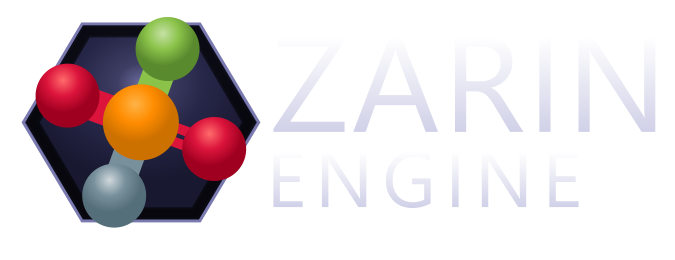
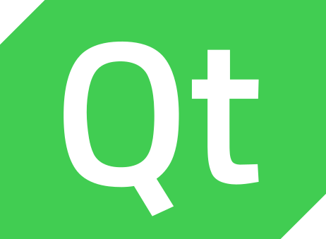
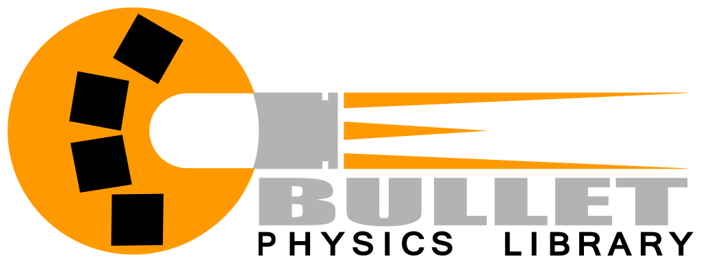
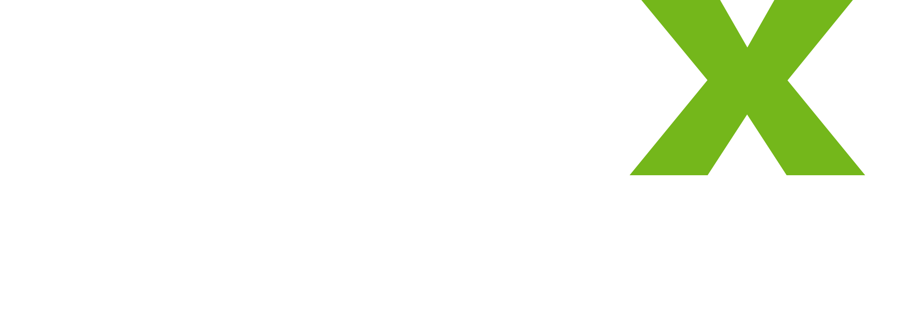
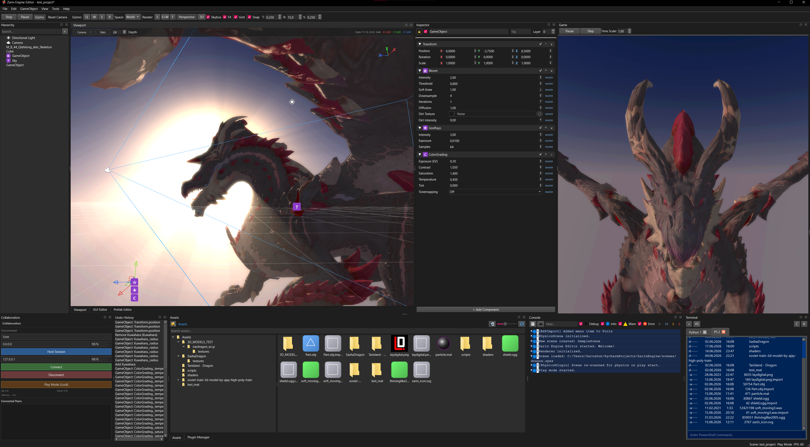

<p align="center">
  
  <br>
  
  
  
</p>
**Zarin Engine** is a 3D game and simulation engine built entirely in Python — ECS-based, with a full visual editor, real-time 3D rendering, physics, audio, scripting, and a UI system. It runs on ModernGL and PyQt6.

It is not a wrapper around Unreal or Unity. It is its own thing, written from scratch, and every piece of it is readable, modifiable, and debuggable in Python.

- **License**: MIT


---

## Why this exists

If you ever wanted to prototype a 3D game in Python without writing C++, fighting CMake, or wrestling with engine source builds — this is the closest thing to that.

The API is heavily inspired by Unity (scene hierarchy, components, inspector, prefabs), so anyone who used Unity will feel at home. The difference is you can open *any* engine file, read it, and change it. No black boxes.

---

## Quick start

```bash
pip install -r requirements.txt
python main.py
```

That opens the editor. No project setup, no config files to write.

To run a built game from a scene file:

```bash
python player.py SampleScene.zpes
```

---

## Features

### Entity Component System

Every object in a scene is an `Entity`. Components add data and behavior. At runtime, the scene calls `update()` and `fixed_update()` on every active component.

- Entities have a UUID, name, parent-child hierarchy, tags, layer, active toggle
- Components expose lifecycle hooks: `on_awake()`, `on_start()`, `on_update(dt)`, `on_fixed_update(dt)`, `on_destroy()`, `on_enable()`, `on_disable()`
- The `ComponentRegistry` auto-discovers and registers component types via decorator
- Components serialize/deserialize to JSON (dictionaries) for scene saving and networking

### Visual Editor

The editor is a full PyQt6 application with:

- **3D viewport** — ModernGL-based, real-time rendering with editor camera (orbit, pan, fly)
- **Scene hierarchy panel** — tree view of all entities, drag to reparent, right-click context menu
- **Inspector panel** — auto-generated fields for every component based on `InspectorField` metadata. Supports: float, int, bool, string, color, enum, Vec2, Vec3, resource path (with file picker), curve, and list fields
- **Project manager** — create/open projects, manage assets
- **Build dialog** — standalone player builds via Nuitka
- **Settings, undo stack UI, curve editor, material preview, model preview**
- **Splash screen** — shows loading progress with random tips

### Rendering

- OpenGL 3.3 Core Profile
- Custom `.shader` file format with `Properties { }` block (similar to Unity's ShaderLab)
- Materials with runtime property editing (colors, floats, textures, vectors, ranges)
- MeshRenderer with cast/receive shadows
- SpriteRenderer with texture, color, flip
- SVG renderer component
- Cameras with perspective and orthographic projection, configurable FOV, near/far, depth
- Directional, Point, and Spot lights with color, intensity, range, shadow support
- Shadows
- Particle system component (editor-gizmo rendered)
- Gizmo system for icons, wireframes, and lines per component

### Physics (3D)

Built-in physics solver running on a background thread:

- **Rigidbody** — mass, drag, angular drag, gravity toggle, kinematic mode, per-axis freeze (position + rotation), velocity, angular velocity, force/torque accumulation
- **BoxCollider** — size, center offset
- **SphereCollider** — radius, center offset
- **CapsuleCollider** — radius, height, direction, center offset
- **MeshCollider** — uses imported mesh triangles
- **CharacterController** — move, jump with configurable height, slope limit, step offset
- **Joint** — connected bodies, anchor points, swing/twist limits (configurable low/high angles)
- Collision events, physics material (friction, bounciness), solver iterations

Physics runs in a separate thread pool, syncs to ECS each frame.

### Physics (2D)

Separate 2D physics with its own components:

- **Rigidbody2D** — mass, drag, gravity, kinematic
- **BoxCollider2D** — size, offset
- **CircleCollider2D** — radius, offset

### Audio

3D positional audio via OpenAL:

- **AudioSource** — clip, volume, pitch, loop, play-on-awake, spatial blend (0-1), volume rolloff curve, min/max distance
- **AudioListener** — attached to an entity, defines the ears
- **ReverbZone** — spatial reverb via OpenAL EFX extensions, with configurable density, diffusion, gain, HF gain, decay time, HF ratio, late delay, diffusion/reflection gains
- AudioSystem handles resource management, clip caching, async loading
- AudioSourceManager manages per-source state (play, stop, pause, loop, spatial)

### Scripting

Entity behaviors are plain `.py` files with a class that implements lifecycle methods:

```python
from core.math3d import Vec3

class Rotator:
    def __init__(self):
        self._entity = None
        self.speed = 90.0

    def on_update(self, dt):
        t = self._entity.get_component_by_name("Transform")
        if t:
            t.rotate(Vec3(0, self.speed * dt, 0))
```

- Script fields (`float`, `int`, `bool`, `str`, `Vec2`, `Vec3`) auto-expose in the Inspector via Python type hints
- Supports reloading at runtime
- Full access to `Input`, `KeyCode`, `Vec2`, `Vec3`, and any engine API
- Multiple ScriptComponents on one entity (`_allow_multiple = True`)

### GUI System

A full immediate-mode-like UI that lives as ECS components:

- **30+ widget types**: Button, Label, TextInput, Slider, Dropdown, Toggle, RadioButton, ProgressBar, ScrollBar, Image, Panel, GroupBox, TabWidget, ListWidget, TreeWidget, TableWidget, HtmlView, Splitter, StackedWidget, ToolBox, ToolButton, Calendar, Dial, SpinBox, DoubleSpinBox, FontCombo, LCDNumber, PlainText, TextEdit, MDIArea, ScrollPanel
- Widgets support anchors (stretch all, left/center/right, top/bottom), styles (via Fusion style), and nested layout
- GuiCanvas renders all widgets as a QPainter overlay
- Widget events (click, change, selection) propagate as Python signals
- Works both in-editor and at runtime

### Constraints

10 constraint components, matching Unity's constraint system:

- **AimConstraint** — aims the entity toward a target with configurable axes, offsets, and world/local space
- **FollowTransformConstraint** — follows another transform with position/rotation weight
- **LookAtConstraint** — looks at a target with up vector control
- **MoveTowardsConstraint** — moves toward target position at configurable speed
- **ParentConstraint** — maintains offset from a source transform (weighted per-axis position/rotation)
- **PositionConstraint** — locks position relative to a source (weighted per-axis)
- **RotateTowardsConstraint** — rotates toward target rotation
- **RotationConstraint** — locks rotation relative to a source (weighted per-axis)
- **ScaleConstraint** — locks scale relative to a source
- **ScaleToConstraint** — scales toward target scale

All constraints support multiple sources with weight blending.

### Math Library

- `Vec2`, `Vec3`, `Vec4`, `Quat`, `Mat4` — full set of vector/matrix math
- All backed by **numpy float64** — precision only downgraded to float32 when uploading to the GPU
- Numba-accelerated helpers (`math_helpers.py`) for mat4 multiply, inverse, look_at, quaternion ops, ray-triangle intersection, etc.
- Curve evaluation, lerp, slerp, cross/dot, normalization, basis vectors

### Asset Import

- **Assimp integration** via C FFI — imports `.obj`, `.fbx`, `.stl`, `.gltf`, `.glb`, `.usdz`, `.dae`, `.blend`, `.3ds`, `.x`, `.lwo`, and many more
- Mesh data (vertices, normals, UVs, tangents, colors, weights) imported via ctypes into numpy arrays
- OBJ parser (fallback for material groups)
- GIF flipbook importer (splits into individual frames)
- Per-file `.import` settings (scale, generate normals/tangents, smoothing angle)
- Texture import with configurable filter (nearest, linear, mipmap), wrap mode (repeat, clamp), and compression (DXT1/5, BC7)

### Prefabs

- Save any entity subtree as `.zpep` (Zarin Prefab)
- Instantiate into any scene with GUID remapping
- Prefab overrides are preserved (per-instance field modifications are serialized alongside the prefab GUID)
- PrefabLibrary for managing prefab assets

### Undo / Redo

Full command-pattern undo system:

- `CreateEntityCommand`, `DeleteEntityCommand`, `SetComponentCommand`, `CompoundCommand`
- Commands can merge (e.g., consecutive value changes combine into one undo step)
- Undo stack in the editor with a history panel
- Keyboard shortcuts: Ctrl+Z (undo), Ctrl+Shift+Z (redo)

### Networking

- **CollabServer / CollabClient** — real-time multi-editor collaboration over TCP with msgpack framing
- Multiple peers see each other's cursors, camera positions, selections, and gizmo operations
- CollaborationManager handles state sync, peer discovery, disconnect timeout
- **NetworkPlugin stubs** — `host()`, `connect()`, `send()`, `broadcast()`, `poll()` ready to wire up with any transport (WebRTC, ENet, raw sockets)
- **NetworkIdentity component** — network-backed entity stub
- **RemoteCollaborator component** — tracks visual representation of remote peers in the editor

### Plugins

- `PluginBase` class with `initialize()`, `shutdown()`, `step(dt)`, lifecycle hooks (`on_play_start`, `on_play_stop`, `on_scene_loaded`, etc.)
- Load from `.py` files or native `.dll` / `.so` shared libraries
- System plugins in `plugins/`, user plugins in `plugins/user/`
- PluginManager with load ordering and dependency support

### Logging

- Built-in `Logger` with DEBUG, INFO, WARNING, ERROR levels
- In-memory ring buffer (2000 entries), listener pattern for UI console panels
- Timestamps and full traceback capture on errors

### Configuration

- JSON-based `Config` class with dot-notation key access (`config.get("physics.gravity")`)
- Global config + per-project config
- Listeners fire on value change
- Default values preserved so missing keys return safe defaults

### Profiling

Frame-by-frame profiler built into the engine core:

- Measures every subsystem: `tick`, `render_scene`, `fixed_update`, `update`, `physics_ms`, `audio_ms`, `ui_ms`, `particle_ms`, `animation_ms`, `gizmo_lines`, `frame_overhead`, and `30+` more
- Color-coded flamegraph export (SVG), 300-frame rolling buffer
- Flat timing data per frame for overlay display

### File Formats

| Extension | Type |
|---|---|
| `.zpes` | Scene file (JSON) |
| `.zpem` | Material file |
| `.zpep` | Prefab file |
| `.shader` | Shader file (custom format with Properties block, GLSL vertex/fragment) |
| `.import` | Per-asset import settings (JSON) |

### 64-bit Precision

All engine math uses `numpy.float64`. Positions, rotations, scales, matrices — everything. The conversion to `float32` happens only at the last moment when uploading vertex data to OpenGL. This eliminates floating-point jitter in large worlds.

---

## Editor Controls

| Action | Input |
|---|---|
| Orbit camera | Right mouse drag |
| Pan camera | Middle mouse drag |
| Zoom | Scroll wheel |
| Fly (while RMB held) | WASD + QE |
| Translate gizmo | W |
| Rotate gizmo | E |
| Scale gizmo | R |
| No gizmo | Q |
| Focus entity | F |
| Delete entity | Delete |
| Undo | Ctrl+Z |
| Redo | Ctrl+Shift+Z |
| Create entity (context menu) | Right-click in viewport |

---

## Requirements

- **Python** 3.13+
- **PyQt6** >= 6.6.0
- **ModernGL** >= 5.10.0
- **NumPy** >= 1.26.0
- **OpenAL** (for audio) — system library
- **Assimp** (bundled DLL/SO for mesh import)

See `requirements.txt` for the full list.

---

## Why you might use this

- You want to make a 3D game or simulation in Python
- You want to understand how a game engine works internally without the complexity of C++ codebases
- You want a Unity-like workflow without leaving the Python ecosystem
- You need to prototype fast and don't want to compile anything
- You want your artists and designers to work in a visual editor while programmers write Python scripts that reload at runtime

## Why you might NOT use this

- It is not optimized for shipping AAA titles. It is a Python engine.
- OpenGL 3.3 core — no Vulkan, no DX12, no raytracing
- The networking layer is mostly stubs for the gameplay side
- It is a single-developer project and the API is still stabilizing

---

## Building a standalone player

```bash
python build_nuitka.py
```

Uses Nuitka to compile the engine into a standalone executable. Configuration in `build_profiles.json`.

---

## License

MIT — do whatever you want. Contributions, forks, and commercial use are welcome.
